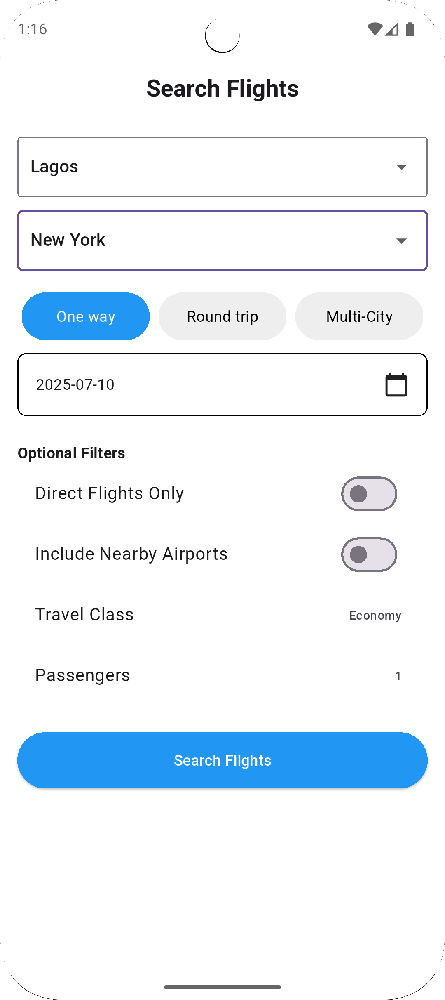
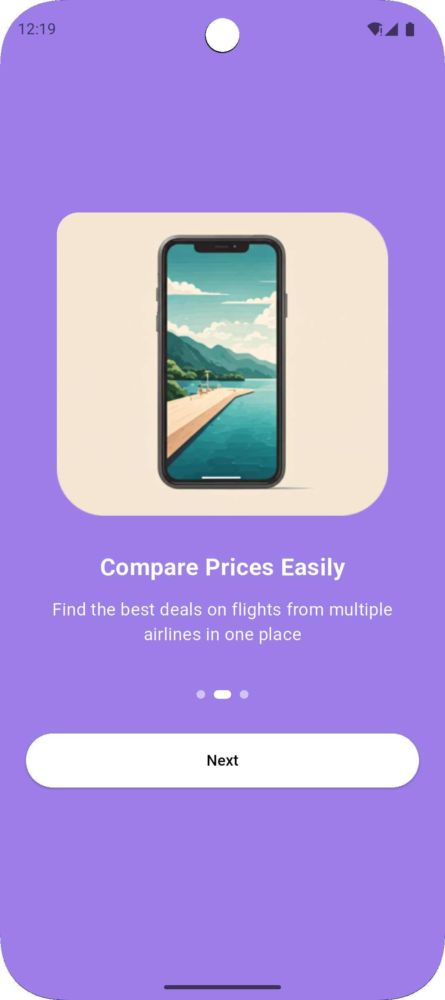

# ✈️ Flight Search App

A modern and visually appealing Flutter app for searching and viewing available flight options between cities. It includes a smooth search experience, real-time filtering, and beautifully designed flight cards.

## 🚀 Features

- 🔍 Search for flights by departure and arrival cities
- 📅 Filter flights by date
- 🧾 Detailed flight info: airline, duration, stops, class, price, and more
- 📱 Mobile-first responsive design
- 💾 Local mock JSON used for flight data (offline testing)

## 📂 Project Structure

```
lib/
├── main.dart
├── features/
│   └── flight_search/
│       ├── presentation/
│       │   ├── search_form.dart
│       │   └── results_page.dart
|       |   |-- workthrough.dart
│       └── provider/
│           └── flight_results_provider.dart
assets/
├── mock_flights.json
└── images/
    ├── banner1.png
    ├── pix1.png
    └── mapp.png
```

## 📦 Dependencies

- `flutter_riverpod` for state management
- `intl` for date formatting
- `flutter` SDK 3.x

## 🧪 Running the App

1. **Install dependencies**:
   ```bash
   flutter pub get
   ```

2. **Run the app**:
   ```bash
   flutter run
   ```

3. **Test the flight search** using mock data (`assets/mock_flights.json`).

## 🧪 Running Tests

To run unit or widget tests:
```bash
flutter test
```

## 📝 Mock Data Format

The app uses a local `mock_flights.json` file structured as follows:

```json
[
   {
    "airline": "Nigerian Airlines",
    "flightNumber": "AS320",
    "aircraft": "Boeing 737",
    "duration": "6h 0m",
    "stops": "1 Stop",
    "checkedBag": "23kg",
    "carryonBag": "7kg",
    "entertainment": "Yes",
    "meals": "Included",
    "price": "$220",
    "class": "Economy",
    "fromTime": "1:00 PM",
    "toTime": "4:00 PM",
    "logo": "assets/images/banner3.jpeg",
    "map" : "assets/images/mapp.png",
    "from": "Lagos",
    "to": "Abuja",
    "date": "2025-07-10"
  }
]
```

## 📦 APK Location
The built APK can be found at:
```
build/app/outputs/flutter-apk/app-release.apk
```

## 🖼 Screenshots

| Search Page | Flight Results |
|-------------|----------------|
|  |  |

## 📝 Developer

**Etim Essang**  
Flutter Developer | [LinkedIn](https://www.linkedin.com/in/etim-essang-6bb637a7/) | [GitHub](https://github.com/demsoft)
## 📄 License
MIT
